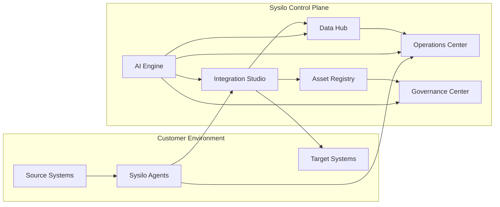

# Sysilo

Enterprise Integration and Data Unification Platform

Sysilo eliminates integration chaos, unifies siloed data, and enables continuous application rationalization for enterprise IT teams. It combines a SaaS control plane with lightweight customer-deployed agents to connect systems that cannot be reached directly. The platform focuses on integration orchestration, data unification, application rationalization, and landscape visibility across SaaS, on-prem, and legacy systems.

## Table of Contents

- [Platform Architecture Overview](#platform-architecture-overview)
- [Primary Components](#primary-components)
- [Repository Structure](#repository-structure)
- [Technology Stack](#technology-stack)
- [Prerequisites](#prerequisites)
- [Getting Started (First-Time Setup)](#getting-started-first-time-setup)
- [Running Services](#running-services)
- [Service Ports and Local Infrastructure](#service-ports-and-local-infrastructure)
- [Configuration](#configuration)
- [Data Flow](#data-flow)
- [Database and Storage](#database-and-storage)
- [Common Make Targets](#common-make-targets)
- [Cross-Cutting Concerns](#cross-cutting-concerns)
- [Documentation Map](#documentation-map)
- [Troubleshooting](#troubleshooting)
- [Contributing](#contributing)
- [License](#license)

## Platform Architecture Overview

Sysilo is a polyglot microservices platform spanning Go, Rust, Python, and TypeScript. It is structured as a SaaS control plane with customer-deployed agents for on-premises connectivity. HTTP ingress is handled by the API Gateway (Go) and gRPC ingress for agent communication by the Agent Gateway (Go). Domain services are built on Rust with Axum. The frontend is a React SPA. AI and ML inference is served through a Python FastAPI service.



## Primary Components

**Integration Studio** -- visual integration orchestration with connections, flows, and automation playbooks.

**Data Hub** -- canonical model definitions, visual field mapping, batch sync pipeline, and unified record viewer.

**Asset Registry** -- grid and graph views of discovered assets and their relationships, backed by Neo4j.

**Rationalization Engine** -- application portfolio scoring, migration scenarios, and cost analysis.

**AI Engine** -- conversational AI, embeddings, recommendations, and intelligent insights served via FastAPI.

**Operations Center** -- metrics ingestion, alert rules, incident management, and notifications.

**Governance Center** -- standards, policies (Rego), approvals workflows, audit logging, and compliance frameworks.

**Agent Architecture** -- lightweight on-premises agent that executes tasks dispatched from the control plane.

## Repository Structure

```
sysilo/
├── agent/                        # Go -- On-premises agent
├── services/
│   ├── api-gateway/              # Go -- REST API gateway, JWT auth, tenant scoping, rate limiting
│   ├── agent-gateway/            # Go -- gRPC agent tunnel termination, heartbeat tracking
│   ├── integration-service/      # Rust -- Integration execution, connections, playbooks, discovery
│   ├── data-service/             # Rust -- Data catalog, lineage, quality, ingestion
│   ├── asset-service/            # Rust -- Asset registry, graph relationships (Neo4j)
│   ├── ops-service/              # Rust -- Metrics, alerts, incidents, notifications
│   ├── governance-service/       # Rust -- Policies, standards, approvals, audit, compliance
│   ├── rationalization-service/  # Rust -- Application scoring, scenarios, playbooks, recommendations
│   └── ai-service/               # Python -- FastAPI for chat, embeddings, recommendations, insights
├── packages/
│   ├── frontend/
│   │   └── web-app/              # React + TypeScript SPA (Vite)
│   └── sdk/
│       └── typescript/           # TypeScript Connector SDK
├── proto/
│   └── agent/v1/                 # Protobuf/gRPC definitions for agent protocol
├── schemas/
│   ├── postgres/                 # PostgreSQL DDL migrations (001 through 009+)
│   └── neo4j/                    # Neo4j constraint definitions
├── scripts/                      # Utility scripts
├── infra/
│   └── docker/                   # Docker Compose for local infrastructure
├── docs/                         # Full documentation set
├── Makefile                      # Build, test, run, and infrastructure targets
└── package.json                  # Root workspace configuration
```

## Technology Stack

| Layer | Technology | Details |
|---|---|---|
| Frontend | React, TypeScript, Vite | Single-page application with React Flow for visual editors |
| API Gateway | Go | JWT authentication, tenant context, plan-based feature gating, rate limiting |
| Agent Gateway | Go | gRPC tunnel termination, agent registration, heartbeat tracking, Kafka forwarding |
| Domain Services | Rust, Axum, SQLx | Integration, Data, Asset, Ops, Governance, Rationalization services |
| AI/ML | Python, FastAPI | Chat, embeddings, recommendations, insights via structlog |
| Agent | Go | On-premises execution with task adapters (PostgreSQL, discovery, playbook) |
| Event Bus | Apache Kafka | Asynchronous task dispatch and result consumption |
| Primary Database | PostgreSQL | Multi-tenant relational storage with UUID primary keys |
| Graph Database | Neo4j | Asset relationship graph |
| Cache | Redis | Session and operational caching |
| Object Storage | MinIO | S3-compatible blob storage for local development |
| Protobuf/gRPC | protoc | Agent-gateway communication contract |

## Prerequisites

- Go 1.22 or later (required by go.mod for the agent and gateways)
- Rust stable toolchain (for Rust services)
- Node.js LTS (for the frontend and TypeScript SDK)
- Docker and Docker Compose (for local infrastructure dependencies)
- protoc (for protobuf code generation)
- make and git

## Getting Started (First-Time Setup)

1. Clone the repository.
2. Run `make init` to create `bin/` and `config/` directories and install Go tools.
3. Run `make dev-up` to start local infrastructure: PostgreSQL, Neo4j, Redis, Kafka, MinIO, and Kafka UI.
4. Run `make db-migrate` to apply database migrations.
5. Create service configuration files as described in `docs/development/configuration.md`.
6. Run `make build` to build all services.

## Running Services

**Go services:**

```
make run-agent
make run-agent-gateway
make run-api-gateway
```

Each Go service reads a YAML config file. See `docs/development/configuration.md` for config file locations and available keys.

**Rust services (from each service directory):**

```
cargo run
```

Rust services are configured via environment variables. Set `DATABASE_URL`, `KAFKA_BROKERS`, `SERVER_ADDRESS`, and `RUST_LOG` as required. See `docs/development/configuration.md` for the full variable reference.

**Frontend:**

```
cd packages/frontend/web-app
npm install
npm run dev
```

The development server starts at http://localhost:3000. Set `VITE_API_URL` to point at the API Gateway (default: http://localhost:8082).

**Connector SDK:**

```
cd packages/sdk/typescript
npm install
npm run build
```

## Service Ports and Local Infrastructure

| Service / Dependency | Default Address |
|---|---|
| API Gateway | :8081 |
| Integration Service | 0.0.0.0:8082 |
| Data Service | 0.0.0.0:8083 |
| Asset Service | 0.0.0.0:8084 |
| Ops Service | 0.0.0.0:8085 |
| Governance Service | 0.0.0.0:8086 |
| Rationalization Service | 0.0.0.0:8087 |
| AI Service | configurable (default 8090) |
| Agent Gateway | :9090 |
| Frontend Dev Server | localhost:3000 |
| PostgreSQL | localhost:5432 |
| Neo4j HTTP | localhost:7474 |
| Neo4j Bolt | localhost:7687 |
| Redis | localhost:6379 |
| Kafka | localhost:9092 |
| Kafka UI | localhost:8080 |
| MinIO API | localhost:9000 |
| MinIO Console | localhost:9001 |

## Configuration

**Go services** use YAML config files (`agent.yaml`, `agent-gateway.yaml`, `api-gateway.yaml`). Pass the path with the `--config` flag or place the file in a default search path. Environment variable overrides are available for common values including `SYSILO_AGENT_ID`, `SYSILO_GATEWAY_ADDRESS`, `SYSILO_JWT_SECRET`, and `SYSILO_LOG_LEVEL`.

**Rust services** use environment variables. Required variables include `DATABASE_URL`, `KAFKA_BROKERS`, `SERVER_ADDRESS`, and `RUST_LOG`.

**Frontend** uses Vite environment variables. Set `VITE_API_URL` to configure the API endpoint.

Refer to `docs/development/configuration.md` for the full configuration reference.

## Data Flow

1. UI triggers integration or playbook actions from frontend pages.
2. Requests route through the API Gateway to the Integration Service.
3. Integration Service emits tasks to Kafka.
4. Agent Gateway distributes tasks to connected agents via gRPC streams.
5. Agent executes task handlers (postgresql, discovery, playbook) on customer infrastructure.
6. Agent returns a TaskResult over the gRPC contract defined in `proto/agent/v1/agent.proto`.
7. The result consumer in the Integration Service updates run state and may call the Asset Service.

## Database and Storage

PostgreSQL schema files live in `schemas/postgres/` as numbered DDL migration files (001 through 009 and later). Neo4j constraint definitions are in `schemas/neo4j/`. Integration-service-specific migrations are in `services/integration-service/migrations/`.

Local infrastructure is managed by Docker Compose in `infra/docker/`. Default development credentials: database user `sysilo`, password `sysilo_dev`, database `sysilo`. The default Neo4j password in local Docker is `sysilo_dev`.

## Common Make Targets

```
make init               -- Initialize repo scaffolding
make dev-up             -- Start local infrastructure (Docker Compose)
make dev-down           -- Stop local infrastructure
make build              -- Build all services
make test               -- Run all tests
make lint               -- Run linters
make fmt                -- Format code
make proto              -- Generate protobuf code
make db-migrate         -- Run database migrations
make run-agent          -- Run the agent
make run-agent-gateway  -- Run the agent gateway
make run-api-gateway    -- Run the API gateway
```

## Cross-Cutting Concerns

**Logging:** Go services use Zap in JSON format by default. Rust services use `tracing`; set `RUST_LOG` to control verbosity. The Python AI service uses `structlog` with JSON output.

**Multi-tenancy:** Tenant context is enforced in the API Gateway middleware and carried through all service layers. Tenant ID is propagated via the `X-Tenant-ID` header.

**Feature gating:** Route-prefix feature checks live in the API Gateway's `plan_gate` middleware.

**Authentication:** JWT-based, managed by the API Gateway. The default development secret is `dev-secret-change-in-production`.

## Documentation Map

- Overview: `docs/overview.md`
- Personas: `docs/personas.md`
- Capabilities: `docs/capabilities.md`
- Development onboarding: `docs/development/onboarding.md`
- Configuration reference: `docs/development/configuration.md`
- Application surface: `docs/development/application-surface.md`
- Architecture: `docs/architecture/` (system-context, control-plane, agent-architecture, ai-engine, security-compliance, multitenancy)
- Data Hub: `docs/data/data-hub.md`
- Canonical models: `docs/data/canonical-models.md`
- Integration Studio: `docs/integration/integration-studio.md`
- Connectors SDK: `docs/integration/connectors-sdk.md`
- Operations Center: `docs/operations/operations-center.md`
- Governance Center: `docs/governance/governance-center.md`
- Rationalization Engine: `docs/rationalization/rationalization-engine.md`
- Deployment model: `docs/deployment/deployment-model.md`
- Architecture Decision Records: `docs/decisions/README.md`
- Glossary: `docs/glossary.md`

## Troubleshooting

- If `make db-migrate` fails, confirm Docker containers are healthy and `sysilo-postgres` is running.
- If a service fails to start, check its config file or environment variables and verify the target port is free.
- If mock discovery does not produce assets, verify the Asset Service is running and `CONSUMER_ASSET_SERVICE_URL` points at it.
- Ensure tenant IDs match between discovery and asset queries. Development defaults use tenant ID `dev-tenant`.

## Contributing

For major technical decisions, follow the ADR process documented in `docs/decisions/README.md`. Keep documentation up to date as implementation decisions land. Documentation uses Mermaid diagrams for portability.

## License

License information for this project is to be determined. Refer to the repository for the current license file when available.
