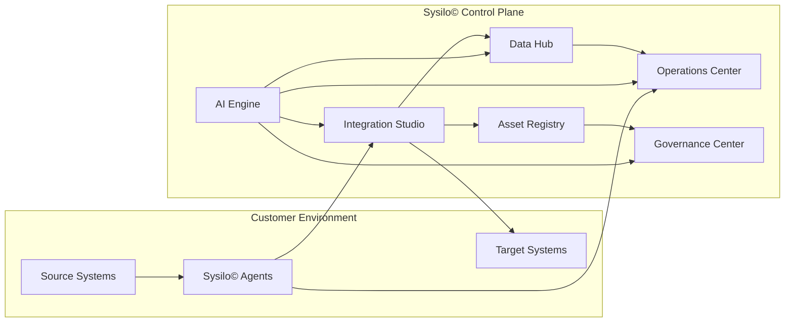
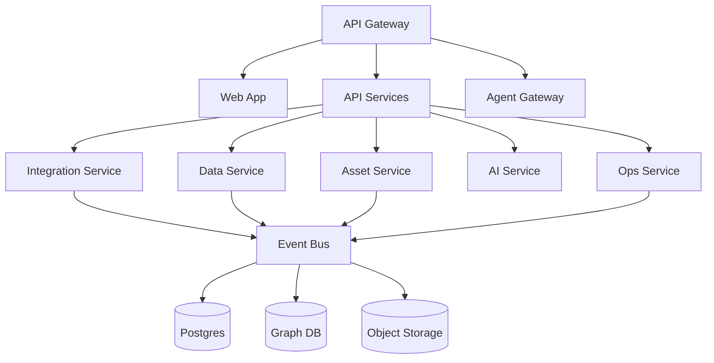
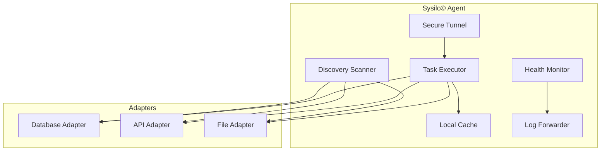

# Sysilo©

Enterprise Integration and Data Unification Platform

Sysilo© is an enterprise integration and data unification platform designed for complex hybrid environments. It combines a SaaS control plane with lightweight customer-deployed agents to connect systems that cannot be reached directly. The platform focuses on integration orchestration, data unification, application rationalization, and landscape visibility. Sysilo© allows enterprise teams to manage integrations across SaaS, on-premises, and legacy systems without requiring direct network access to customer environments.

## Core Outcomes

- Integration orchestration across SaaS, on-prem, and legacy systems
- Data unification into canonical models without owning the warehouse
- Rationalization workflows to reduce redundancy
- Visibility into systems, APIs, data entities, and their relationships

## Platform Architecture



Primary platform components:

- **Integration Studio** -- design, test, and deploy integration workflows
- **Data Hub** -- unifies data into canonical models
- **Asset Registry** -- grid and graph views of asset relationships (systems, APIs, data entities)
- **Rationalization Engine** -- evaluates and consolidates redundant applications
- **AI Engine** -- horizontal shared infrastructure for intelligent recommendations
- **Operations Center** -- monitors health, manages incidents, maintains agents
- **Governance Center** -- defines standards, policies, and compliance

## Target Personas

| Persona | Primary Focus | Key Surfaces |
|---------|---------------|--------------|
| Integration Developers | Build, test, deploy integrations | Integration Studio, CLI, IDE plugins |
| Platform and Ops Engineers | Monitor health, manage incidents, maintain agents | Operations Center, Agent management |
| Enterprise Architects | Define standards, govern integrations, drive rationalization | Governance Center, Asset Registry |

## Technology Stack

| Layer | Technology | Language |
|-------|-----------|----------|
| Frontend | React, Vite | TypeScript |
| API Gateway | Custom gateway with JWT auth, CORS, rate limiting | Go |
| Agent Gateway | gRPC tunnel termination | Go |
| On-Prem Agent | Lightweight runtime with secure tunnel, task executor, discovery scanner | Go |
| Integration Service | Integration execution engine | Rust |
| Data Service | Data pipeline execution | Rust |
| Asset Service | Asset registry (Postgres + Neo4j graph) | Rust |
| Operations Service | Monitoring and operations | Rust |
| Governance Service | Policy engine | Rust |
| Rationalization Service | App rationalization workflows | Rust |
| AI Service | ML inference | Python |
| Event Bus | Kafka | -- |
| Primary Database | PostgreSQL | PLpgSQL |
| Graph Database | Neo4j | -- |
| Cache | Redis | -- |
| Object Storage | MinIO (local dev) | -- |
| IPC | Protocol Buffers / gRPC | -- |

### Language Composition

| Language | Percentage |
|----------|-----------|
| Rust | 42.6% |
| TypeScript | 33.6% |
| Go | 17.8% |
| Python | 3.4% |
| PLpgSQL | 1.7% |
| Makefile | 0.5% |
| Other | 0.4% |

## Repository Structure

```
sysilo/
  .planning/                     -- Internal planning documents
  agent/                         -- Go on-prem agent
  docs/                          -- Project documentation
    architecture/                -- System context, control plane, agent, AI engine, security, multi-tenancy
    data/                        -- Data Hub and canonical models
    decisions/                   -- Architecture Decision Records (ADRs)
    deployment/                  -- Deployment model
    development/                 -- Onboarding, configuration, application surface
    diagrams/                    -- Mermaid diagram index
    governance/                  -- Governance Center docs
    integration/                 -- Integration Studio, Connectors SDK
    operations/                  -- Operations Center docs
    plans/                       -- Implementation plans
    rationalization/             -- Rationalization Engine docs
  infra/                         -- Infrastructure as code (Docker Compose, etc.)
  packages/
    frontend/                    -- React + TypeScript web application
    sdk/                         -- Connector SDKs (TypeScript)
  proto/                         -- Protobuf/gRPC service definitions
    agent/                       -- Agent protocol definitions
  schemas/
    neo4j/                       -- Neo4j graph database schemas
    postgres/                    -- PostgreSQL migration schemas
  scripts/                       -- Build and utility scripts
  services/
    agent-gateway/               -- Go gRPC agent tunnel termination
    ai-service/                  -- Python AI/ML inference
    api-gateway/                 -- Go API gateway with auth
    asset-service/               -- Rust asset registry
    data-service/                -- Rust data pipeline execution
    governance-service/          -- Rust policy engine
    integration-service/         -- Rust integration execution
    ops-service/                 -- Rust operations and monitoring
    rationalization-service/     -- Rust rationalization workflows
```

## Prerequisites

- Go 1.22 or later (required by go.mod for agent and gateways)
- Rust stable toolchain (for all Rust services)
- Node.js LTS (for frontend and SDK)
- Docker and Docker Compose (for local infrastructure)
- protoc (Protocol Buffers compiler, for gRPC code generation)
- make
- git

## Getting Started

1. Clone the repository.

2. Initialize the repo scaffolding:

   ```bash
   make init
   ```

   Creates `bin/` and `config/` directories and installs Go tools.

3. Start local infrastructure:

   ```bash
   make dev-up
   ```

   Starts Postgres, Neo4j, Redis, Kafka, and MinIO via Docker Compose.

4. Run database migrations:

   ```bash
   make db-migrate
   ```

5. Configure services. See `docs/development/configuration.md` for the complete reference.

6. Build all services:

   ```bash
   make build
   ```

## Running Services

### Go services (agent, agent-gateway, api-gateway)

```bash
make run-agent
make run-agent-gateway
make run-api-gateway
```

Each service reads a YAML config file. See `docs/development/configuration.md` for configuration details.

### Rust services (integration-service, data-service, asset-service, ops-service, governance-service, rationalization-service)

From each service directory:

```bash
cargo run
```

Environment variables are required for database and Kafka connections. See `docs/development/configuration.md` for the complete reference.

### Frontend

```bash
cd packages/frontend/web-app
npm install
npm run dev
```

The dev server runs at `http://localhost:3000`. It uses `VITE_API_URL` (default `http://localhost:8082`) to reach the backend.

### Connector SDK (TypeScript)

```bash
cd packages/sdk/typescript
npm install
npm run build
```

## Local Dependency Ports

| Service | Address |
|---------|---------|
| PostgreSQL | localhost:5432 |
| Neo4j Browser | localhost:7474 |
| Neo4j Bolt | localhost:7687 |
| Redis | localhost:6379 |
| Kafka | localhost:9092 |
| Kafka UI | localhost:8080 |
| MinIO API | localhost:9000 |
| MinIO Console | localhost:9001 |
| API Gateway | localhost:8081 |
| Integration Service | localhost:8082 |
| Data Service | localhost:8083 |
| Asset Service | localhost:8084 |
| Ops Service | localhost:8085 |
| Governance Service | localhost:8086 |
| Agent Gateway (gRPC) | localhost:9090 |
| Frontend Dev Server | localhost:3000 |

## Configuration Overview

- **Go services** use YAML config files specified with a `--config` flag or default search paths. Each service ships a config template. Environment variable overrides are supported.
- **Rust services** use environment variables: `DATABASE_URL`, `KAFKA_BROKERS`, `SERVER_ADDRESS`, and service-specific variables.
- **Frontend** uses `VITE_API_URL` to point to the API Gateway or Integration Service.

See `docs/development/configuration.md` for the complete configuration reference.

## Common Make Targets

| Target | Description |
|--------|-------------|
| `make dev-up` | Start local development environment (databases, Kafka, etc.) |
| `make dev-down` | Stop local development environment |
| `make dev-clean` | Stop environment and remove all data volumes |
| `make dev-logs` | Tail logs from local infrastructure |
| `make build` | Build all services |
| `make test` | Run all tests |
| `make lint` | Run linters |
| `make fmt` | Format code |
| `make proto` | Generate protobuf/gRPC code |
| `make init` | Initialize repo scaffolding |
| `make db-migrate` | Run database migrations |

## Testing Discovery Locally

### Mock discovery (development only)

POST `/dev/mock-discovery` on the Integration Service bypasses Kafka and writes assets directly to the Asset Service. This is the fastest path for local development:

```bash
curl -X POST http://localhost:8082/dev/mock-discovery \
  -H "Content-Type: application/json" \
  -d '{"agent_id": "local-dev", "tenant_id": "dev-tenant"}'
```

### Real discovery

POST `/discovery/run` dispatches a discovery task to Kafka. This path requires Kafka to be running and a Sysilo© Agent to be connected and registered.

## Control Plane Service Architecture



## Agent Architecture



Key agent properties:

- Outbound-only mTLS connections
- Local credential isolation
- Offline buffering and replay
- Remote diagnostics and staged updates

## Glossary

- **Agent** -- Lightweight runtime deployed in customer environments to execute tasks and discovery.
- **Asset** -- Any system, API, data entity, or integration registered in the platform.
- **Canonical model** -- Standardized entity schema used by the Data Hub for unified data shapes.
- **Control plane** -- Sysilo©-hosted services that orchestrate integrations and governance.
- **Integration** -- A defined workflow that moves or transforms data between systems.
- **Rationalization** -- The process of evaluating and consolidating redundant applications.

## Documentation Index

| Document | Path |
|----------|------|
| Overview | [docs/overview.md](docs/overview.md) |
| Personas | [docs/personas.md](docs/personas.md) |
| Capabilities | [docs/capabilities.md](docs/capabilities.md) |
| Development onboarding | [docs/development/onboarding.md](docs/development/onboarding.md) |
| Development configuration | [docs/development/configuration.md](docs/development/configuration.md) |
| Application surface | [docs/development/application-surface.md](docs/development/application-surface.md) |
| Architecture -- system context | [docs/architecture/system-context.md](docs/architecture/system-context.md) |
| Architecture -- control plane | [docs/architecture/control-plane.md](docs/architecture/control-plane.md) |
| Architecture -- agent | [docs/architecture/agent-architecture.md](docs/architecture/agent-architecture.md) |
| Architecture -- AI engine | [docs/architecture/ai-engine.md](docs/architecture/ai-engine.md) |
| Architecture -- security and compliance | [docs/architecture/security-compliance.md](docs/architecture/security-compliance.md) |
| Architecture -- multi-tenancy | [docs/architecture/multi-tenancy.md](docs/architecture/multi-tenancy.md) |
| Data Hub | [docs/data/data-hub.md](docs/data/data-hub.md) |
| Canonical models | [docs/data/canonical-models.md](docs/data/canonical-models.md) |
| Integration Studio | [docs/integration/integration-studio.md](docs/integration/integration-studio.md) |
| Connectors SDK | [docs/integration/connectors-sdk.md](docs/integration/connectors-sdk.md) |
| Operations Center | [docs/operations/operations-center.md](docs/operations/operations-center.md) |
| Governance Center | [docs/governance/governance-center.md](docs/governance/governance-center.md) |
| Rationalization Engine | [docs/rationalization/rationalization-engine.md](docs/rationalization/rationalization-engine.md) |
| Deployment model | [docs/deployment/deployment-model.md](docs/deployment/deployment-model.md) |
| ADRs | [docs/decisions/README.md](docs/decisions/README.md) |
| Glossary | [docs/glossary.md](docs/glossary.md) |
| Implementation plans | [docs/plans/](docs/plans/) |

## Troubleshooting

- If `make db-migrate` fails, confirm Docker containers are healthy and `sysilo-postgres` is running (`docker ps`).
- If a service fails to start, check its config file or environment variables and verify that the required ports are not already in use.
- If the frontend cannot reach the backend, verify that `VITE_API_URL` is set correctly and that the target service is running.
- If Neo4j connections fail for the Asset Service, ensure `NEO4J_PASSWORD=sysilo_dev` is set. This is the default in the Docker Compose configuration.

## Architecture Decision Records

ADRs are tracked in `docs/decisions/`. Write an ADR when making decisions about:

- Choosing a major technology or framework
- Defining service boundaries and APIs
- Selecting data models or storage approaches
- Security and compliance decisions

Each ADR follows a standard template with sections for context, the decision, consequences, and alternatives considered. See `docs/decisions/README.md` for the template and index of existing records.
