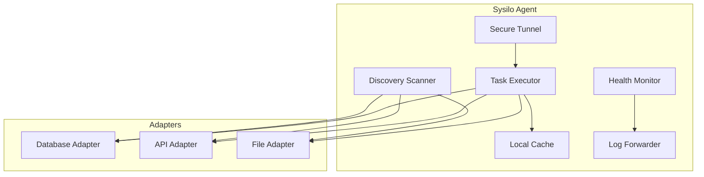

# Agent architecture

## Intent

Describe the agent runtime deployed in customer environments.

## Component diagram

## Key properties

- Outbound-only mTLS connections
- Local credential isolation
- Offline buffering and replay
- Remote diagnostics and staged updates

## Open questions

- Which languages and runtimes for adapters in V1?
- How will agent upgrades be rolled out and rolled back?
