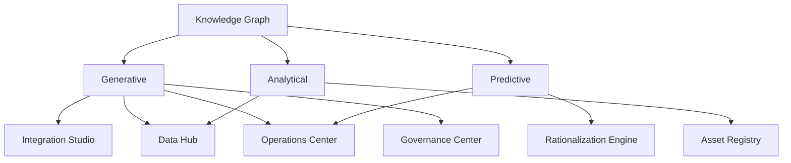

# AI engine

## Intent

Describe the shared AI layer that powers assistive and predictive features.

## Architecture

## Example capabilities

- Mapping suggestions and code generation
- Anomaly detection and predictive alerts
- Impact modeling and rationalization scoring

## Open questions

- Where does feature storage live for the knowledge graph?
- Which models are hosted vs vendor-provided?
