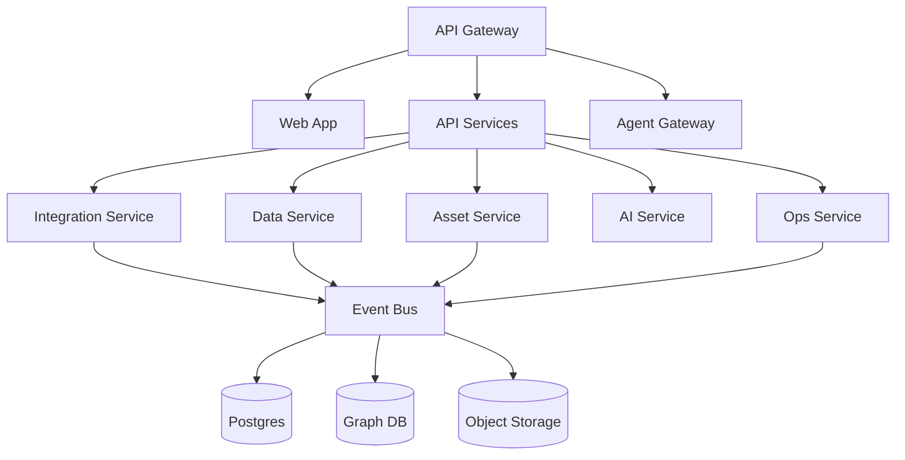
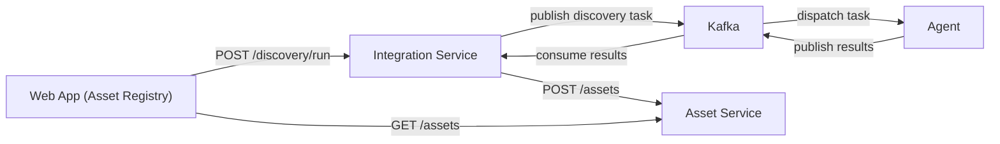

# Control plane architecture

## Intent

Describe the core services and how they communicate.

## Logical view

## Discovery task flow (current)

For local development, `POST /dev/mock-discovery` on the integration-service bypasses Kafka and sends generated assets directly to the Asset Service.

## Service boundaries

- API Gateway: authentication, routing, rate limiting
- API Services: user-facing APIs and orchestration
- Core services: integration, data, asset, ops, AI
- Event bus: durable eventing and workflow decoupling

## Open questions

- Which services are synchronous vs event-driven for V1?
- Do we need a separate job scheduler service?
