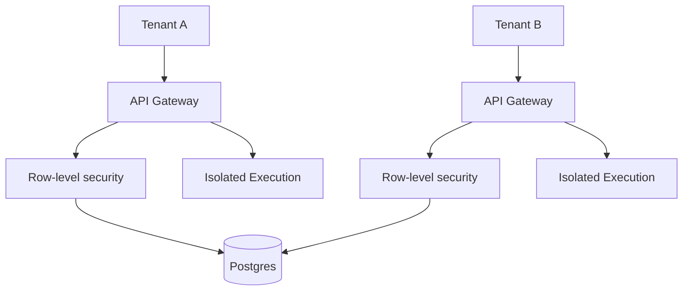

# Multi-tenancy

## Intent

Define how tenant isolation is enforced across data, compute, and network layers.

## Isolation model

## Rules

- Tenant ID on all records
- Isolated execution containers per tenant
- Per-tenant rate limits and quotas
- Agent connections scoped to tenant

## Open questions

- Do we require per-tenant encryption keys in V1?
- What is the approach for tenant data export and deletion?
