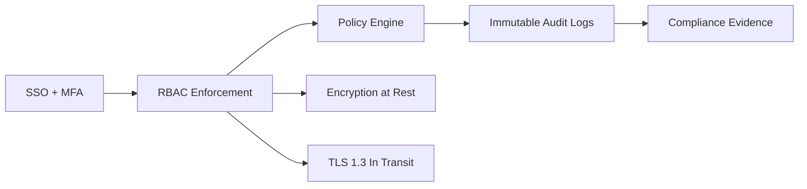

# Security and compliance

## Intent

Capture the security posture, controls, and compliance requirements.

## Control flow

## Core requirements

- Encryption at rest with AES-256
- TLS 1.3 in transit
- SSO with SAML or OIDC, MFA required
- Fine-grained RBAC
- Immutable audit logs with retention options
- SOC 2 Type II, GDPR, HIPAA-ready

## Open questions

- What is the minimum audit retention for V1?
- What data classifications are required in V1?
