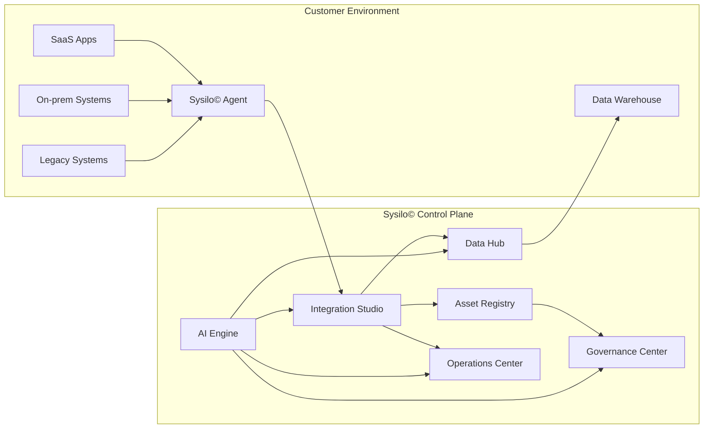

# System context

## Intent

Show how Sysilo© interacts with customer environments, external systems, and data warehouses.

## Context diagram

## Open questions

- Which system types must be supported for V1 discovery?
- Is the data warehouse always external, or do we support internal storage?
