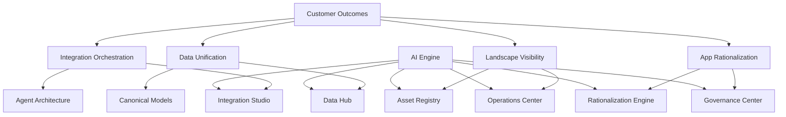

# Capabilities

## Intent

Provide a capability map that links the platform components to customer outcomes.

## Capability map

## Notes

- Capabilities are grouped by outcome to keep the roadmap aligned to business value.
- The AI engine is horizontal and should be modeled as shared infrastructure.
