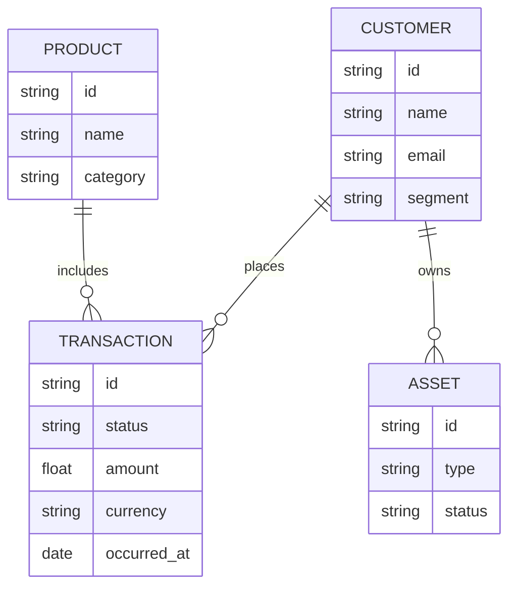

# Canonical models

## Intent

Define the core business entities used for data unification.

## Entity overview

## Notes

- This is a minimum viable model for V1 and should be expanded per domain.
- Attribute definitions and constraints will live in the schema repo.

## Open questions

- Which system becomes source of truth per entity?
- How do we version canonical model changes?
