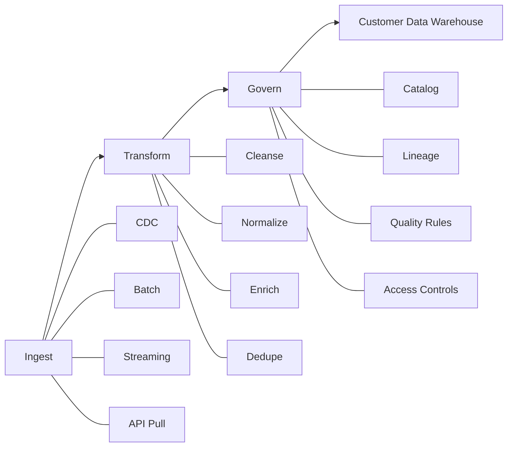

# Data Hub

## Intent

Describe how data is ingested, transformed, and governed before landing in the warehouse.

## Pipeline

## Responsibilities

- Provide ingestion and transformation, not storage
- Enforce canonical models and data quality rules
- Track lineage for compliance and impact analysis

## Open questions

- What transformation engine powers V1?
- Are streaming and batch both required for V1?
