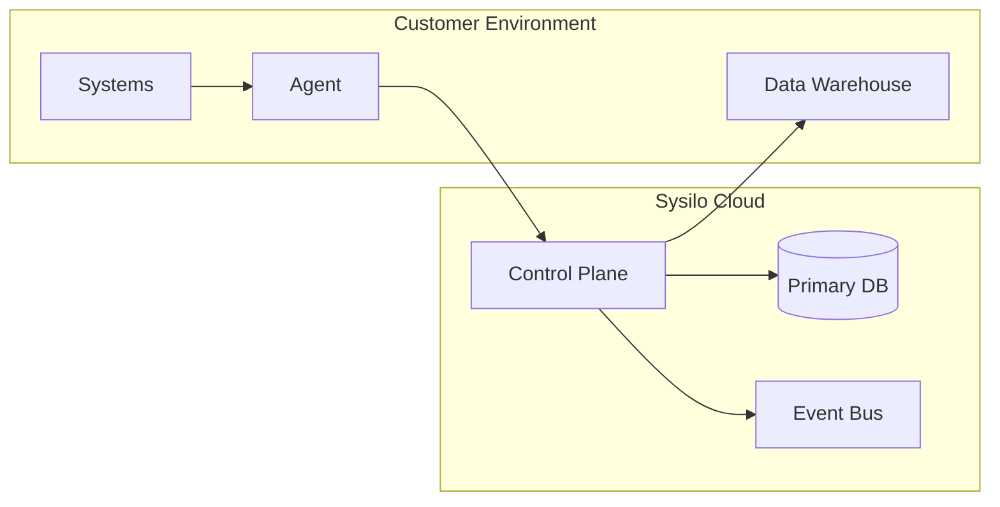
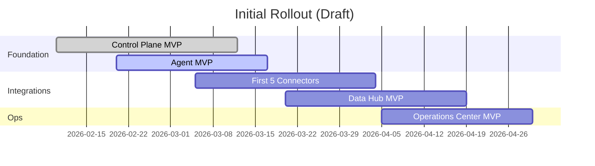

# Deployment model

## Intent

Describe how the SaaS control plane and customer agents are deployed.

## Deployment topology

## Rollout plan (draft placeholder dates)

## Open questions

- What is the minimum supported agent footprint?
- Which regions are required for V1?
