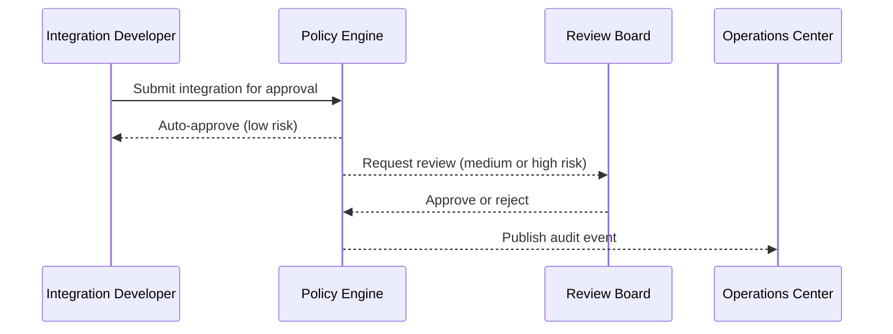

# Governance Center

## Intent

Define policy enforcement, review workflows, and compliance reporting.

## Approval workflow (sequence)



## Policy example

```
POLICY: pii-data-encryption
WHEN:   data_classification contains "PII"
THEN:   require encryption = "AES-256"
        require audit_logging = true
        require access_approval = "data-steward"
```

## Open questions

- What is the initial set of policy rules for V1?
- Should approvals support time-bound exceptions?
