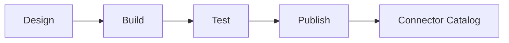

# Connectors SDK

## Intent

Document how connector authors build, test, and publish connectors.

## Current connection model (implemented)

The current implementation centers on connection management in the Integration
Service (`/connections` APIs), with typed connector families and validation.

### Supported connector types

| Connector type | Required `config` fields |
| --- | --- |
| `postgresql` | `host`, `port`, `database` |
| `mysql` | `host`, `port`, `database` |
| `snowflake` | `account`, `warehouse`, `database` |
| `oracle` | `host`, `port`, `service_name` |
| `salesforce` | `instance_url` |
| `rest_api` | `base_url` |

### Supported auth types

- `credential`
- `oauth`
- `api_key`

### Connection API surface

- `GET /connections`
- `POST /connections`
- `GET /connections/:id`
- `PUT /connections/:id`
- `DELETE /connections/:id`
- `POST /connections/:id/test`

### Validation behavior

- `POST /connections` and `PUT /connections/:id` validate required config keys
  by connector type.
- `POST /connections/:id/test` currently performs config-shape validation and
  updates test status; it does not run live external connectivity checks yet.

## Connector lifecycle

## SDK goals

- Support proprietary and legacy systems
- Provide a simple local dev loop
- Enforce security and schema validation

## Open questions

- Which languages are supported in V1?
- Do we host a public connector registry?
