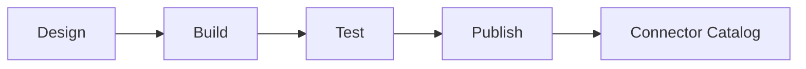

# Connectors SDK

## Intent

Document how connector authors build, test, and publish connectors.

## Connector lifecycle

## SDK goals

- Support proprietary and legacy systems
- Provide a simple local dev loop
- Enforce security and schema validation

## Open questions

- Which languages are supported in V1?
- Do we host a public connector registry?
