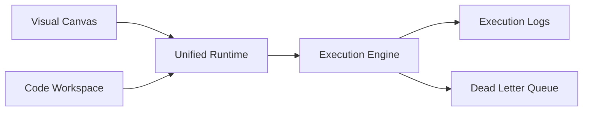
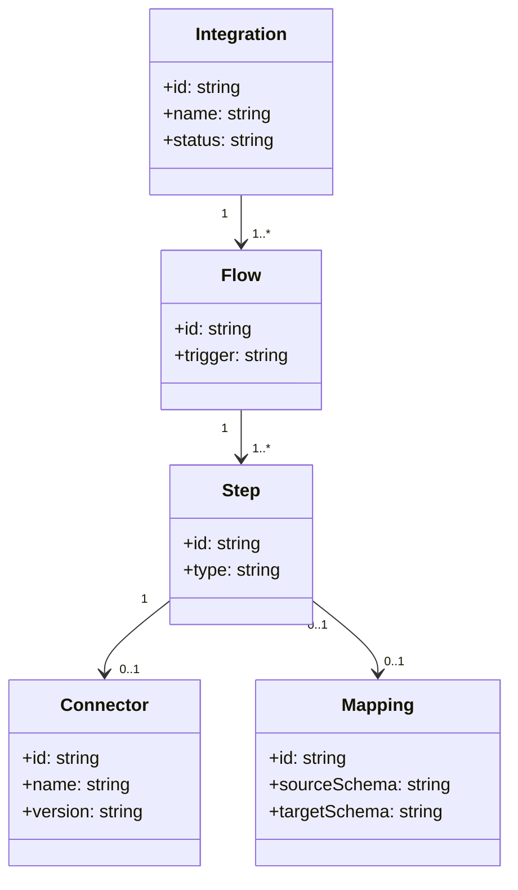

# Integration Studio

## Intent

Describe the Integration Studio surfaces for visual and code-first workflows.

## Architecture diagram

## Domain model (draft)

## Open questions

- What is the minimal set of step types for V1?
- How do we reconcile visual and code-first edits?
