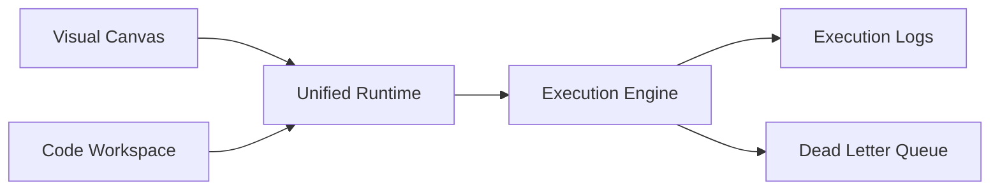
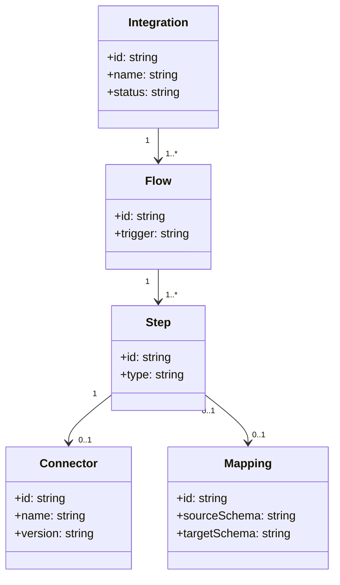

# Integration Studio

## Intent

Describe the Integration Studio surfaces for visual and code-first workflows.

## Current implementation status

Frontend routes:

- `/integrations`: list page is implemented with static sample records.
- `/integrations/new`: visual studio canvas.
- `/integrations/:id/edit`: visual studio canvas seeded with sample nodes.

Current studio capabilities:

- Drag-and-drop node authoring with React Flow.
- Node categories:
  - Source: PostgreSQL, MySQL, Salesforce, S3
  - Transform: Map, Filter, Aggregate, Join
  - Target: Snowflake, BigQuery, PostgreSQL, S3
- Editable node config panel per selected node.
- Edge creation between nodes and minimap/controls on canvas.

Current limitations:

- Save/Run actions are UI-level only and currently log to console.
- Integration list data is static and is not yet backed by integration APIs.
- No persisted schema/version workflow in the studio UI yet.

## Architecture diagram

## Domain model (draft)

## Open questions

- What is the route contract between studio save/run actions and integration
  execution APIs?
- Should Integration Studio share reusable step primitives with operations
  playbook editing?
