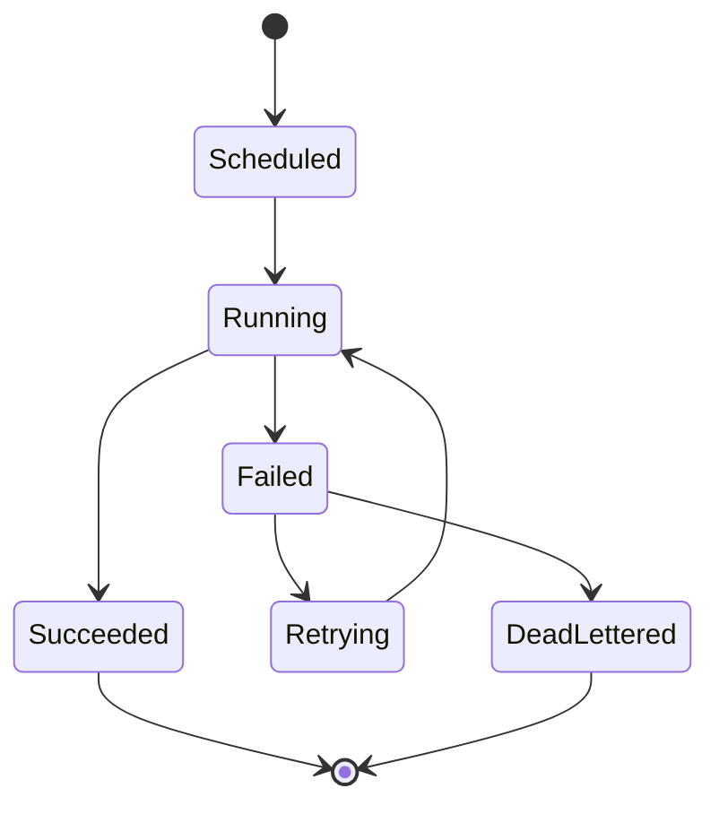

# Operations Center

## Intent

Define how operators observe health, respond to incidents, and manage agents.

## Integration execution states

## Core capabilities

- Real-time health and pipeline status
- Alerting and incident workflows
- Log aggregation with correlation IDs
- SLA monitoring and execution history

## Open questions

- Which alert channels must be supported in V1?
- What is the minimum incident severity model?
