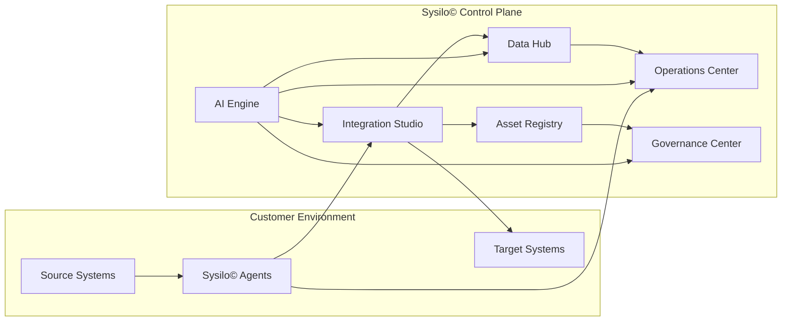

# Overview

## Summary

Sysilo© is an enterprise integration and data unification platform for complex hybrid environments.
It combines a SaaS control plane with lightweight customer-deployed agents to connect systems
that cannot be reached directly. The platform focuses on integration orchestration, data
unification, application rationalization, and landscape visibility.

## Core outcomes

- Integration orchestration across SaaS, on-prem, and legacy systems
- Data unification into canonical models without owning the warehouse
- Rationalization workflows to reduce redundancy
- Visibility into systems, APIs, data entities, and their relationships

## Platform at a glance

## Primary components

- Integration Studio
- Data Hub
- Asset Registry (grid + graph views of asset relationships)
- Rationalization Engine
- AI Engine
- Operations Center
- Governance Center
- Agent architecture

## Open questions

- What are the first two integrations to harden as reference implementations?
- Which systems are the highest priority for asset discovery?
- What are the minimum viable governance policies for V1?
