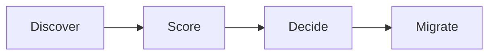
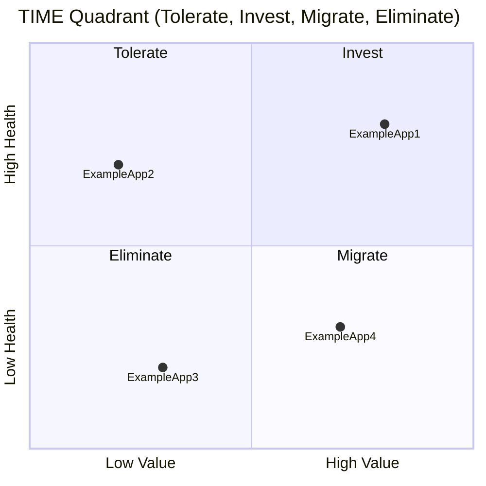

# Rationalization Engine

## Intent

Describe the workflow for discovering redundancy, scoring applications, and orchestrating consolidation.

## Lifecycle phases

## TIME quadrant

## Scoring dimensions

- Business value
- Technical health
- Integration complexity
- Cost
- Strategic fit

## Open questions

- What data sources feed scoring in V1?
- Who owns approval for migration plans?
